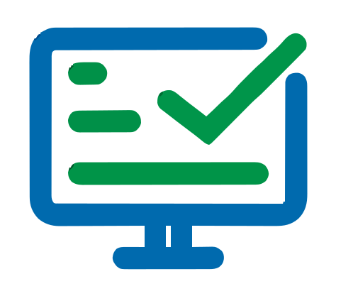

  

<h1 align="center">📘 Testora</h1>
<h3 align="center">Smart Assessment & Classroom Testing Platform</h3>

---

## 📌 Overview

Testora is a **secure, AI-powered digital assessment platform** designed for corporate training institutes and modern learning environments.

It enables any user to:

- 🏫 Instantly create classrooms  
- 📝 Build intelligent tests  
- 🔐 Enforce strict exam security  
- 📊 Analyze performance  
- 📦 Manage submissions  

All within a streamlined, analytics-driven ecosystem.

Unlike traditional trainer–trainee restricted systems, **Testora offers flexible role capability**, allowing any registered user to:

- Create classrooms  
- Publish tests  
- Attempt tests in joined classrooms  
- Monitor performance  
- Enforce secure examination rules  

Testora combines **automation, AI-assisted test creation, advanced analytics, and exam security enforcement** into a single professional platform.

---

  

---

# 🎯 Problem It Solves

Traditional digital test systems face major challenges:

- ❌ Manual test creation effort  
- ❌ Weak exam security (tab switching, cheating)  
- ❌ No AI-assisted question generation  
- ❌ Complicated classroom coordination  
- ❌ Limited analytics visibility  
- ❌ Manual grading delays  
- ❌ Poor submission tracking  

### ✅ Testora solves these by delivering:

- AI-powered test creation  
- Automated validation & grading  
- Advanced classroom analytics  
- Secure exam environment  
- Structured attempt tracking  
- Seamless reporting  

---

# 👤 User Model (Flexible Role System)

Testora does **not** restrict users strictly as "Trainer" or "Trainee".

Any registered user can:

- Create classrooms  
- Join classrooms  
- Create and publish tests  
- Attempt tests in enrolled classrooms  
- View analytics and reports  

### Ideal For:

- Corporate trainers  
- Training coordinators  
- HR teams  
- Skill development programs  
- Peer evaluation environments  

---

# 🏗️ Core Platform Structure

After login, users see:

## 1️⃣ Created Classrooms

Classrooms created by the user.

Each Classroom Card Displays:

- Classroom Name  
- Created Date  
- Number of Participants  
- Number of Active Tests  
- Rename Option  
- Delete Option  

---

## 2️⃣ Enrolled Classrooms

Classrooms joined via invite link.

Inside each enrolled classroom:

- Tests Section  
- Submissions Section  

---

# 📊 Classroom Dashboard (Analytics Engine)

Each classroom includes a powerful analytics dashboard:

- 📈 Line Chart – Test vs Maximum Attempts  
- 🥧 Pie Chart – Participants vs Tests Distribution  
- 👥 Total Participants  
- 📝 Total Tests  
- 📊 Submission Percentage  
- 🏆 Top 5 Performing Participants  
- 📋 Recently Published 5 Tests  
- 📉 Performance Trends Overview  

This enables real-time corporate training performance tracking.

---

  

---

# 📝 Test Management System

## 🗂 Test Tabs

- All Tests  
- Submissions  
- Published  
- Drafts  

---

## 📋 Test Creation

Tests can be created:

- Manually  
- Using AI-generated questions  

### Supported Question Types:

- Multiple Choice  
- Single Choice  
- True or False  
- Fill in the Blank  
- Matching  

---

# 🧠 AI-Powered Question Generation

Testora includes AI-assisted test creation to:

- Generate structured questions instantly  
- Reduce manual effort  
- Improve question quality  
- Speed up assessment creation  

This dramatically reduces preparation time for corporate trainers.

---

# 🔄 Test Attempt Workflow

Each Test Card Displays:

- ▶️ Start / Reattempt Button  
- 🔁 Remaining Attempts  
- ⚙️ Auto-Correction Status  
- ⏳ Timed / Untimed Mode  
- 🔄 Limited / Unlimited Attempts  
- 📅 Creation Date  

---

## After Attempt

Each attempt provides:

- 📊 Marks Scored  
- 📈 Performance Chart  
- ⏱️ Time Taken  
- 🕒 Submission Time  
- 📄 Detailed Report View  

### Two Tabs Available:

- To Be Graded  
- Completed  

---

# 🔐 Advanced Exam Security System

Testora includes enterprise-grade security controls:

### 🚫 Tab Switch Detection

If a user switches tabs during a test:

- Violation is recorded  
- Warning triggered  
- Auto submission (if configured)  

---

### ⛔ Copy / Paste Restriction

Prevents content extraction during tests.

---

### ⚠️ Auto Submission on Violation

Test is automatically submitted when:

- Security violations exceed allowed limits  

These features ensure fair, secure, and malpractice-resistant assessments.

---

# 📈 Performance & Reporting

Each test attempt includes:

- Visual Performance Chart  
- Attempt History  
- Graded vs Pending Attempts  
- Time Analysis  
- Detailed Score Breakdown  

Helps organizations measure:

- Skill progression  
- Attempt behavior  
- Engagement levels  
- Improvement patterns  

---

# 📦 Submission Management

In the Submissions Section, users can view:

- Submitted Tests  
- To Be Graded Attempts  
- Completed Corrections  
- Report Downloads  

All attempts are clearly categorized and tracked.

---

# 🔗 Classroom Collaboration

- Invite Link Generation  
- Real-time participant enrollment  
- Attempt visibility control  
- Publish / Unpublish test controls  

---

# 🚀 Key Features

- 📋 Dynamic Classroom Creation  
- 🧠 AI Question Generation  
- 🔐 Secure Exam Environment  
- 📊 Real-Time Analytics Dashboard  
- 📈 Performance Tracking  
- 📦 Structured Submission Management  
- 🔄 Multiple Attempt Handling  
- 📝 Auto & Manual Grading  
- 📉 Visual Reports & Charts  
- ⚙️ Flexible User Role Model  

---

# 🛠️ Technology Stack

- Frontend: Modern Web Framework  
- Backend: RESTful API Architecture  
- Database: Structured Relational Database  
- AI Integration: AI-powered question engine  
- Security Layer: Client-side & server-side validation  
- Analytics Engine: Chart-based visualization system  

---

# 🌍 Ideal Use Cases

- Corporate Training Institutes  
- HR Skill Assessments  
- Internal Company Evaluations  
- Certification Programs  
- Employee Upskilling Platforms  
- Bootcamps & Training Academies  

---

# 🎯 Why Testora?

Testora is not just a testing tool.  
It is a **secure, intelligent, analytics-driven corporate assessment ecosystem**.

It combines:

✔ AI  
✔ Security  
✔ Automation  
✔ Analytics  
✔ Flexibility  

Into one powerful platform.

---

  <strong>© 2026 Testora — Smart. Secure. Scalable.</strong>

